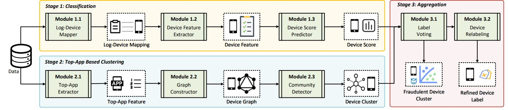
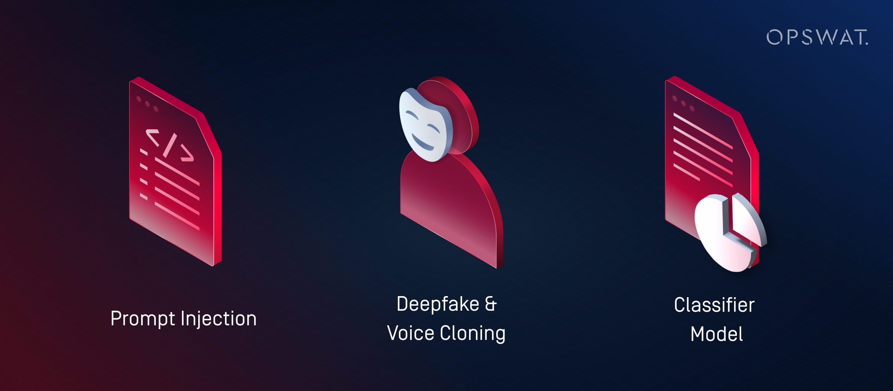

# A Hacker's Mind: Real World Applied Insights

**A Hacker's Mind** analyses how hacking transcends code, networks, and cryptographic systems. Schneier frames hacking as exploiting rules, incentives, and institutional structures. This post examines direct applications from the book through modern examples and thought experiments.

---

## Core Premise Illustrated

Rules are not objective barriers. They are design artifacts. Anyone with incentive, creativity, and domain insight can search for unintended outcomes inside procedural, legal, economic, or algorithmic frameworks.

---

## Example 1: Financial Arbitrage Logic

Financial actors regularly search for yield through regulatory gaps. Schneier treats these behaviors as hacks because they bypass design intent while staying within legal formalism.

Practical mapping:

| Layer of Rule | Intended Function | Hack Example Type |
|---------------|-------------------|-------------------|
| Banking regulation | Risk mitigation | Synthetic credit risk transfer |
| Tax code | Revenue collection | Profit shifting via IP domicile |
| Accounting rules | Accurate reporting | Structured loss harvesting |

Open scenario

Assume a platform pays bonuses for monthly growth. Growth is computed only from active users who log in. A team creates a background service that triggers auto login. Identify: Is it technically legal within internal policies, and what are likely governance consequences.

---

## Example 2: Gaming Platforms and ToS Exploitation

Online game economies mirror real fiscal systems. Schneier argues that ToS loopholes function similarly to law loopholes. The main difference is who controls enforcement and observation.

Analytical application questions:

1. Is the exploit visible to other participants or only to system custodians.
2. Does the exploit create negative externalities.
3. Would patching require rule rewrite or infrastructure change.

Case example: Resource Respawn Exploit

Players discover that switching servers resets scarce resource timers. They coordinate rotation to extract disproportionate resources. This fits the book's definition of a hack because it exploits system logic rather than intended challenge.

 <!-- TODO -->

---

## Example 3: Machine Learning Policy Hacking

Schneier extends the hacking concept to algorithmic governance. ML systems encode rules implicitly. Adversaries do not break authentication or encryption but manipulate the inputs that the model treats as valid.

Direct applications:
- Credit models influenced by synthetic data trails
- Content ranking influenced by coordinated engagement pods
- Ad fraud via latency pattern mimicry

**Extracted from the paper: Understanding and Detecting Mobile Ad Fraud Through the Lens of Invalid Traffic (Suibin et al, 2021)**

---

## Example 4: Policy-level Hacking by Institutions

Schneier states that high resource actors shift from hacking technical systems to hacking normative systems by designing rules that match their interests.

Example domains:
- Corporate lobbying generating favorable regulatory text
- Patent strategies that restrict competitive innovation while offering no real novelty
- Binding arbitration clauses used to relocate dispute resolution

Case Study: Patents from Drug Discoveries

**Objective:** Analyze how rules around intellectual property can be exploited.  

- **Attacker:** Pharmaceutical companies  
- **Rule Target:** Patent system / regulatory approval pathways  
- **Exploit Vector:** Filing “evergreening” patents or minor modifications to extend exclusivity  
- **Impact Scope:** Market control, delayed generic competition, higher drug prices  
- **Patch Cost:** Legal reform, stricter patent examination, enforcement mechanisms  
- **Detection Probability:** Moderate – requires regulatory scrutiny and patent litigation  

This example illustrates Schneier’s concept of policy-level hacking: using high-level system rules to gain strategic advantage without breaking laws.

## Example 5: AI as a Hacker

One of Schneier’s most urgent points: AI will soon be a hacker in its own right. It can identify and scale loopholes and exploits in legal, social, and economic systems. 
Schneier on Security

Implication: Traditional governance and patch cycles may be too slow. We need “red-teaming” for policy and algorithmic systems, not just software.

Examples exposed in: "AI Hacking: How Hackers Use Artificial Intelligence in Cyberattacks. What You Need to Know About the Dark Side of AI. Sep 8, 2025 by OPSWAT"

## Example 6: Defensive Strategies: Red-Teaming & Resilience

Schneier emphasizes that effective defense is not passive but proactive. Traditional security often reacts to attacks after they occur, but organizations can significantly reduce risk by employing red-teaming: controlled, adversarial testing that simulates attacks on systems, policies, or processes. The goal is to identify vulnerabilities before malicious actors exploit them, providing actionable insights for mitigation.

The principle extends beyond technical cybersecurity. In regulation design, for instance, a financial authority might commission a red-team exercise to anticipate how market participants could exploit loopholes in new compliance rules. Similarly, corporate governance can benefit by stress-testing decision-making structures, highlighting how incentives or misaligned authority could be manipulated. Public policy, particularly in areas such as election security or public health, can adopt adversarial simulations to anticipate societal or institutional vulnerabilities.

Real-world examples illustrate this principle:

Cybersecurity Red Teams: Large tech companies routinely hire ethical hackers to probe their software, uncovering vulnerabilities before they are weaponized by malicious actors. For instance, Microsoft and Google operate ongoing bug bounty programs that reward researchers for identifying flaws, a direct application of proactive red-teaming.

Financial Stress Testing: The 2008 financial crisis highlighted failures in risk management and regulatory oversight. Post-crisis, institutions and regulators implemented stress tests on banking systems, simulating extreme economic scenarios to uncover weaknesses in capital and liquidity management, a red-team exercise in financial risk.

Policy Simulation: Governments increasingly employ “war-gaming” scenarios to test emergency response plans. For example, pandemic response simulations reveal gaps in supply chains, communication, and inter-agency coordination, allowing corrective measures to be implemented before real crises occur.

Corporate Decision Audits: Red-teaming can also apply to strategic decision-making. A board of directors might simulate competitive threats or internal fraud attempts to evaluate whether governance structures incentivize ethical behavior and mitigate internal risks.

The broader implication is that resilience is not merely about building robust systems but also about continuously probing their weaknesses in controlled, adversarial ways. Schneier’s perspective reframes the concept of hacking: understanding potential exploits is as much about shaping defensive culture and institutional foresight as it is about technical countermeasures. Institutions that embrace red-teaming cultivate adaptive intelligence, reducing systemic risk and improving long-term resilience.

# AI Disclosure
This blog contains content generated with the assistance of artificial intelligence tools. While the insights and analyses reflect careful research and editorial review, AI was used to help draft, structure, and refine portions of the text. All factual statements, interpretations, and conclusions remain the responsibility of the author.