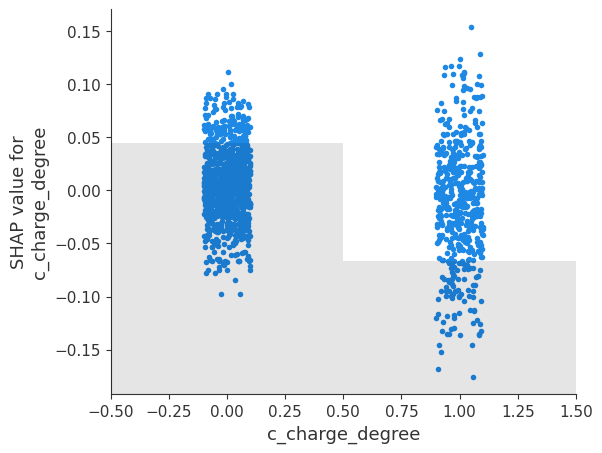
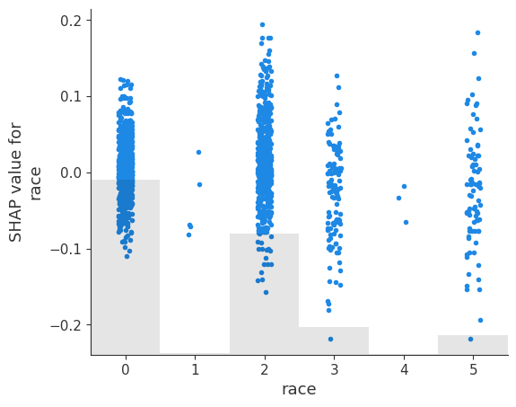
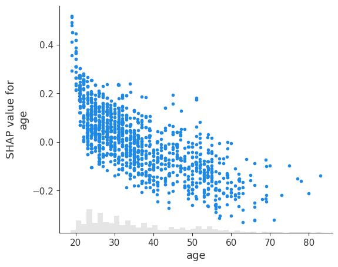
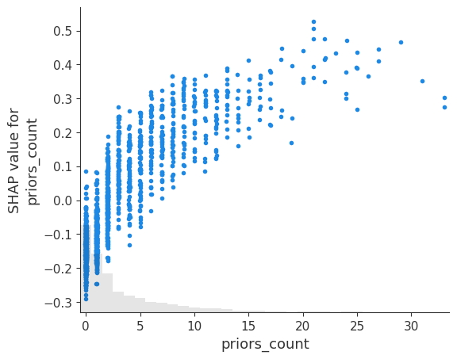
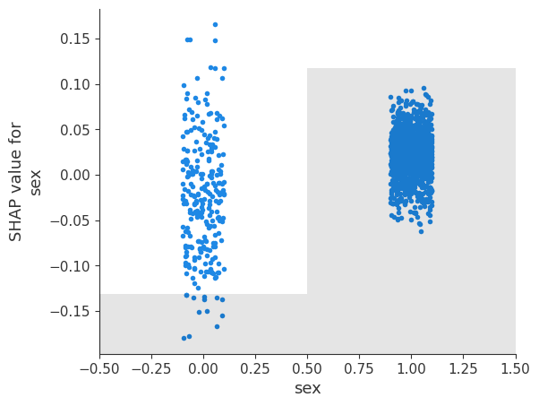
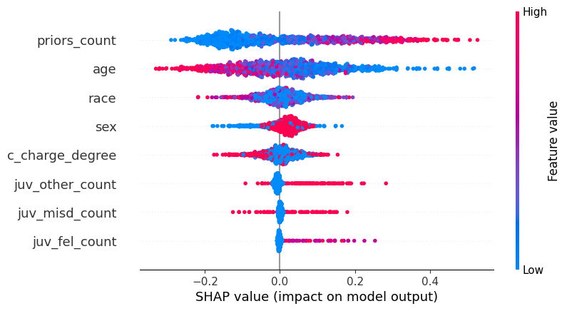

> **TL;DR** — SHAP (SHapley Additive exPlanations) is a principled framework for interpreting ML predictions. By borrowing ideas from cooperative game theory, SHAP quantifies the contribution of each feature for a given prediction. In this guide, we’ll unpack the math, intuition, and practical implementation.


---

## 1. Motivation — Why Interpretability Matters

Modern machine learning models are increasingly complex, think ensembles, gradient boosting, or deep neural networks. Without interpretability, these models are **black boxes**. Understanding *why* a model makes a prediction is essential for:

- Building trust with stakeholders  
- Debugging bias or overfitting  
- Complying with regulatory standards (e.g., GDPR)  

SHAP provides a **unified and theoretically sound** way to measure feature contributions for any prediction.

---

## 2. The Game Theory Behind SHAP

### 2.1 Shapley Values

In cooperative game theory, the **Shapley value** distributes a total "payout" fairly among players according to their contributions. Formally, for a set of players \( N = \{1, 2, ..., n\} \) and a value function \( v(S) \) representing the payout for a coalition \( S \subseteq N \):

$$
\phi_i(v) = \sum_{S \subseteq N \setminus \{i\}} \frac{|S|!(n-|S|-1)!}{n!} [v(S \cup \{i\}) - v(S)]
$$

Where:  
- \( \phi_i(v) \) is the Shapley value for player \( i \)  
- \( v(S) \) is the payout from coalition \( S \)  

Intuition: It’s the **average marginal contribution** of player \( i \) across all possible coalitions.

### 2.2 Translating to Machine Learning

- **Players** → input features  
- **Coalitions** → subsets of features considered by the model  
- **Payouts** → model predictions (or probabilities, log-odds, etc.)  

In SHAP, we treat each feature as a "player" and compute its average contribution to the model output, ensuring a **fair and consistent attribution**.

---

## 3. Additive Explanation Model

SHAP expresses a model's output as an **additive combination** of feature contributions:

\[
f(x) = \phi_0 + \sum_{i=1}^{M} \phi_i
\]

Where:  
- \( \phi_0 \) = base value (expected model output)  
- \( \phi_i \) = contribution of feature \( i \)  
- \( f(x) \) = prediction for sample \( x \)  

This decomposition satisfies three key properties:  

1. **Local accuracy** — the sum of SHAP values equals the model output  
2. **Missingness** — features not in the model have zero attribution  
3. **Consistency** — if a model changes so a feature’s contribution increases, its SHAP value does not decrease  

These properties make SHAP a robust tool for interpretable ML.

---

## 4. Implementation Breakdown

### 4.1 Computing SHAP Values (Conceptually)

Computing exact Shapley values requires evaluating all \( 2^n \) feature subsets — quickly infeasible for large models.  

SHAP uses **model-specific approximations**:

| Model Type | SHAP Method | Complexity | Notes |
|------------|------------|------------|-------|
| Tree-based | TreeSHAP | Polynomial | Exact for trees |
| Linear | LinearSHAP | Linear | Closed-form solution |
| Deep learning | DeepSHAP | Approximate | Uses layer-wise relevance propagation |
| Model-agnostic | KernelSHAP | Approximate | Weighted linear regression |


## ⚖️ Case Study: Understanding Recidivism Risk with SHAP


TreeSHAP efficiently distributes credit along tree paths, caching intermediate results to avoid exponential computation.


### 🔍 Scenario

Malik Johnson, a 27-year-old with one prior felony, was flagged as **low risk** by an AI risk assessment tool and granted parole. Some community stakeholders have questioned whether this classification was appropriate.  

We’ll use **SHAP values** to unpack the model’s reasoning and show which factors influenced this decision.

We use the **COMPAS dataset**, which tracks recidivism risk for individuals.

<details>

```python
import pandas as pd
from sklearn.model_selection import train_test_split
from sklearn.ensemble import RandomForestClassifier

# Load dataset
url = "https://raw.githubusercontent.com/propublica/compas-analysis/master/compas-scores-two-years.csv"
df_compas = pd.read_csv(url)

# Select features and target
features = ['age', 'sex', 'race', 'priors_count', 'juv_fel_count', 'juv_misd_count', 'juv_other_count', 'c_charge_degree']
df = df_compas[features + ['two_year_recid']].dropna()
df = df[df['c_charge_degree'].isin(['F', 'M'])]  # Felony or Misdemeanor

# Encode categorical variables
df['sex'] = df['sex'].astype('category').cat.codes
df['race'] = df['race'].astype('category').cat.codes
df['c_charge_degree'] = df['c_charge_degree'].astype('category').cat.codes

# Train-test split
X = df[features]
y = df['two_year_recid']
X_train, X_test, y_train, y_test = train_test_split(X, y, test_size=0.2, random_state=42)

# Train a Random Forest model
model_compas = RandomForestClassifier(random_state=42)
model_compas.fit(X_train, y_train)

focus_instance = pd.DataFrame([{
    "age": 27,
    "sex": 1,  # Male
    "race": 1,  # African-American
    "priors_count": 1,
    "juv_fel_count": 0,
    "juv_misd_count": 0,
    "juv_other_count": 0,
    "c_charge_degree": 1  # Felony
}])

pred = model_compas.predict(focus_instance)
print("Prediction for Malik Johnson:", pred)

````

</details>


**Focused Prediction: Malik Johnson**


> The Machine learning model predicts **no recidivism risk**.

---

### Visualizing SHAP Values

<details>

```python
import shap

# Sample background data
X_background = shap.utils.sample(X_train, 100)

# Create TreeExplainer
explainer = shap.TreeExplainer(model_compas, X_background)

# SHAP values for the focus instance
shap_values_focus = explainer(focus_instance)

# SHAP values for the test set (for global insights)
shap_values_test = explainer(X_test)

shap.plots.waterfall(shap_values_focus[0])

shap.plots.force(shap_values_focus[0])

shap.plots.scatter(shap_values_test[:, "age",1])
shap.plots.scatter(shap_values_test[:, "priors_count",1])
shap.plots.scatter(shap_values_test[:, "c_charge_degree",1])
shap.plots.scatter(shap_values_test[:, "race",1])
shap.plots.scatter(shap_values_test[:, "sex",1])


shap.plots.summary(shap_values_test, X_test)


```

</details>

### **1. Waterfall Plot**

The **waterfall plot** shows how the model starts at a baseline value (the average prediction) and then **accumulates contributions from each feature** to reach the final prediction for a single individual.

* The plot starts with the **base value**, which is essentially what the model would predict if it knew nothing about the person.
* Each subsequent bar represents a feature’s contribution: arrows or bars pointing to the right increase the prediction, bars pointing to the left decrease it.
* The plot ends at the **final predicted value** for that individual.

**Purpose:** This plot helps you understand **why the model made a particular decision** for one person, showing exactly which features pushed the outcome up or down.


* For Malik, **low priors_count** and **age** contributed most to the low-risk prediction.



* For a different felon for which its predicted class is 1, **low priors_count** and **age** contributed most to the low-risk prediction.

Subject B



* SHAP values **sum exactly** to the predicted outcome, ensuring no feature’s effect is unaccounted for.

---

### **2. Force Plot**

The **force plot** is a more dynamic version of the waterfall. It visualizes the same idea — how features push the prediction up or down — but in a **single, continuous line** with arrows indicating direction.

* Features pushing the prediction higher are shown in one color (e.g., red), and those pushing it lower are shown in another (e.g., blue).
* The plot is often interactive, so hovering over different areas can display exact contribution values.

**Purpose:** It’s a visually intuitive way to see the **tug-of-war between features** that drives the final prediction.

* For Malik:




---

### **3. SHAP dependence plot**

The **dependence plot** looks at **one specific feature** and shows how its value affects predictions across all individuals.

* The x-axis shows the feature’s actual value (e.g., number of prior offenses).
* The y-axis shows the SHAP value (the feature’s contribution to the prediction).
* Color often represents another feature that interacts with the main one, helping reveal **feature interactions**.

**Purpose:** This lets you understand **how changes in a feature affect predictions**, and whether its effect depends on other features.




What we observe:

Clear binary split: Misdemeanors (0) vs Felonies (1)
- Misdemeanor charges consistently produce negative SHAP values (−0.10 to +0.05), pushing predictions toward lower recidivism risk
- Felony charges generate predominantly positive SHAP values (−0.05 to +0.15), pushing predictions toward higher recidivism risk
Interpretation:
The model treats the severity of the current charge as a strong indicator of future behavior. Being charged with a felony rather than a misdemeanor substantially increases the predicted likelihood of recidivism. This makes intuitive sense, as felonies represent more serious criminal behavior.

> For Malik Johnson: His felony charge contributes positively to his recidivism risk score, working against a low-risk classification.

**Race**



What we observe:

Six racial categories (coded 0–5) show distinctly different SHAP value distributions
- Category 0 trends toward positive SHAP values (increasing risk)
- Category 2 shows the widest variability, with both high positive and high negative values
- Categories 3, 4, and 5 show more modest, mixed effects

Interpretation:
Race is a significant factor in the model's predictions, which raises serious fairness and bias concerns. Different racial groups receive systematically different risk assessments even when controlling for other factors. This reflects potential bias in either the training data (historical patterns of recidivism) or the criminal justice system itself.
Ethical Issue: Race should ideally have minimal to no impact on recidivism predictions, as it's a protected demographic characteristic. Its prominence suggests the model may perpetuate historical biases.
> For Malik Johnson: His racial category may be contributing unfairly to his risk assessment.

**Age**




What we observe:

Strong negative correlation: as age increases from 20 to 80, SHAP values decrease from +0.5 to −0.3
- Younger defendants (20–30) receive substantial positive contributions to their risk scores
- Older defendants (60+) receive negative contributions, lowering their predicted risk

The histogram shows most defendants are concentrated in the 20–40 age range

Interpretation:
Age is one of the model's strongest predictors. Youth is treated as a significant risk factor for recidivism, while older age is protective. This aligns with criminological research showing that criminal behavior tends to decline with age (the "age-crime curve"). However, the steep gradient means young offenders are systematically rated as higher risk.

> For Malik Johnson: At 27 years old, he falls in the high-risk age range, which pushes his prediction toward recidivism despite his limited criminal history.

**Priors count**



What we observe:

Clear positive correlation: more prior convictions lead to higher SHAP values. The relationship is nearly linear and monotonic.

- 0–5 priors result in negative to neutral SHAP values (lower risk)
- 15+ priors generate strongly positive SHAP values (+0.3 to +0.5), dramatically increasing predicted risk

Interpretation:

Criminal history is the most important and legitimate predictor in the model. Each additional prior conviction incrementally increases the predicted recidivism risk. This feature shows consistent, interpretable behavior without problematic interactions. Unlike demographic features, prior convictions represent actual behavioral history and are a legally defensible basis for risk assessment.

>For Malik Johnson: His single prior conviction is one of his strongest protective factors, producing a negative SHAP contribution that works in favor of a low-risk classification.

**Sex**



What we observe:

Binary split: Females (0) vs Males (1)
- Female defendants receive predominantly negative SHAP values (−0.15 to 0), decreasing predicted risk
- Male defendants receive positive SHAP values (−0.05 to +0.10), increasing predicted risk

Clear separation between groups with some overlap

Interpretation:

Sex is a meaningful predictor in the model, with males systematically assigned higher recidivism risk than females. While this may reflect actual statistical patterns in recidivism data, it raises fairness concerns about using demographic characteristics in high-stakes decisions. Like race, sex is a protected characteristic that arguably shouldn't directly influence criminal justice outcomes.


Ethical Issue: Even if statistically predictive, using sex as a feature may violate principles of individual assessment and equal treatment under the law.


> For Malik Johnson: Being male contributes positively to his risk score, working against a low-risk classification.

---

### **4. Summary Plot**

The **summary plot** provides a **global view across the dataset**. Instead of focusing on one individual, it shows the **overall importance and effect of each feature** for the model.

* Features are ranked by importance — the ones that most strongly influence predictions appear at the top.
* Each dot represents a single individual’s SHAP value for that feature. Color often encodes the **actual feature value** (e.g., dark red = high, dark blue = low).
* Spread of the dots shows the variability: some features may consistently push predictions in the same direction, while others vary.

**Purpose:** This helps answer: *“Which features matter most, and how do they generally affect the model?”*



This comprehensive visualization shows the relative importance and impact of all features:
Feature Ranking (by importance):

- priors_count (top) - Most important feature

Wide horizontal spread shows high impact on predictions
Blue (low values) push predictions left (negative), Pink/Red (high values) push right (positive)


- age (second)

Pink (younger) increases risk, Blue (older) decreases risk
Substantial spread indicating strong influence


- race (third)

Mixed colors show complex interactions
Concerning that this demographic factor ranks so high


- sex (fourth)

Moderate impact with clear directional pattern


- c_charge_degree (fifth)

Moderate importance, felonies increase risk


- juv_other_count, juv_misd_count, juv_fel_count (bottom)

Relatively minor impact on predictions
Juvenile history matters less than adult criminal history

---

### **Putting It All Together**

* **Waterfall and force plots** → individual explanations. “Why did the model make this prediction for this person?”
* **Summary plot** → overall feature importance across the dataset. “What features matter most for predictions in general?”
* **Dependence plot** → how a single feature behaves across all individuals and interacts with others.

---

### Key Takeaways

* **Transparency:** SHAP reveals the model’s reasoning to both technical and non-technical audiences.
* **Feature contributions:** Malik’s low-risk classification is primarily driven by **few prior offenses** and **age**.
* **Consistency:** SHAP’s additive property ensures all contributions sum to the predicted outcome.
* **Stakeholder insight:** Community members or policymakers can see **why the model made this decision**, which helps evaluate fairness and potential bias.


### 5. Practical Tips

Global vs Local explanations: Use summary plots for global insights and force_plot for individual predictions.

Handling correlated features: Shapley values assume feature independence. Consider techniques like shap.dependence_plot to detect interactions.

Performance: For very large datasets, consider sampling or using approximate=True in TreeSHAP.

### Conclusion

SHAP bridges the gap between complex models and human interpretability, offering a mathematically principled way to explain predictions. Whether for compliance, debugging, or trust-building, SHAP equips data scientists with actionable insight into how features drive model behavior.

By mastering SHAP, you not only make your models transparent but also gain the power to communicate their decisions clearly.


> Some of the contents present in this blog have been created with the assistance of GPT-5. Reach out to me if you think there are inaccuracies.
